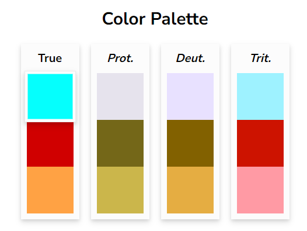

# Tuning-PlaySite
## Team Members
1. Megha Chandra Nandyala
2. Amisha Himanshu Somaiya
3. ShaoJung Kan
4. Wenzheng Zhao
## Teaser

  

## Motivation
We are a team of four from the Electrical and Computer Engineering department with a shared interest in machine learning. With this project, we aim to create an interactive visualization useful to the ML community. After brainstorming on some ideas such as “Choice of ML model”, “Swarm Optimization Algorithm”, “High-dim data visualization”, we initially decided to do *An ML Model Pipeline*.  Our story board was as follows:

  

But after discussions with TA Sebastin Santy, we decided to focus on one deliverable with deeper insights than to provide a vast but shallow overview of a very broad topic. Thus, we zeroed down on one of the tedious aspects of ML model building: **hyper parameter tuning**. 

Hyperparameter tuning can be a frustrating and tedious process, since it involves randomness and multiple runs of the model to be run under various settings to find the hyper-parameter combinations that give the best performance metrics. Furthermore, the process of hyperparameter tuning is rarely documented or explained. All most all papers gloss over the process that led to their result. Replicating Deep Learning papers results with the same model is tough due to this black box of tuning steps. To address this challenge, we aim to draw insights from this process using visualization and provide users with the ability to explore and decide which hyperparameters their model needs. Present story board is as follows:

  

### Note
We started this with having final project as the final deliverable in mind. For this assignment, we decided to scope in to stick with setting up the basic interaction for further future explorations.
## Data
We couldn't find any dataset available with all the experiments of hyperparameters which was a major hurdle as we need a lot of data to infer insights. So we decided to do these experiments on our own but due to time constraints, we chose only ResNet50 model and trained it on CIFAR-10 dataset which consists 60000 images. 

For the choice of hyperparameters, 
1. The most important one is optimizer. We went with three popular optimizers people generally choose: Adam (perhaps 90% use this), SGD and RMSProp. 
2. For epochs, we chose 1 to 10 with an increment of 1 and later with an increment of 30 upto 150. 
3. Next for the batch size, we chose 16, 32 and 64. We could have gone for 128 but limited machine capabilities. 
4. Later one of the most important yet mostly guessed is learning rate. In general most people choose between 1e-4 to 1e-2. For this we choose 0.0001, 0.0025, 0.005, 0.075 and 0.01. 

So the total rows of data came upto 765(3\*17\*3\*5). For the performance metrics, we choose Accuracy, Loss and F1-score(to compensate Precision and Recall).
## Interactive Visualization
### Accessing Visualization
-> Access our visualization [here](https://cse512-23s.github.io/Tuning-PlaySite/) or 

-> Download the repository and run the HTML page through a server like [LiveServer](https://marketplace.visualstudio.com/items?itemName=ritwickdey.LiveServer).
### Design Decisions
#### Choice of Chart Type
This visualization aims to provide the user an informative and interactive view of the relationship between various hyper-parameters and the effect of changing 1/more of these on the performance metrics. We considered several multi-variate plots such as small multiples, trellis scatter plots, grouped bar charts etc. We found the [parallel coordinates plot](https://syntagmatic.github.io/parallel-coordinates/examples/brushing.html) shared by Professor to be the most effective and expressive for our task. Each feature/variable is represented by a separate axis. All the axes are equally spaced and parallel to each other. Each sample/observation is plotted horizontally.
#### Choice of Encodings
Optimizer, Epochs, Batch Size and Learning Rate are the four independent variables in the visualization.

- Epochs, Batch Size and Learning Rate:

Variable type: Quantitative; Encoding: vertical axes in the plot; Scale : Linear

- Optimizer : 
Variable type : Categorical; Encoding : Color - all samples are colored grouped by optimizer 
(Adam : Blue, RMSProp : Red, SGD : Orange)

Accuracy, Loss and F1 Score are the three dependent variables in the visualization.
Variable type: Quantitative; Encoding: vertical axes in the plot; Scale : Linear
#### Design Layout

  

The layout and design decisions for this visualization are made with the user experience in mind. The vertical parallel plot is chosen instead of the horizontal plot with the dimensions placed on the left and performance metrics measures are on the right for the eyes to follow them from left(input) to right(output). The progressive selection bar shows the number of active samples in real time. The title is on the top middle. The description of the visualization is provided for the user’s reference. Parallel Coordinates are sometimes difficult to understand by someone new to this plot. Thus, hyperlinks for understanding parallel coordinates and brushing are provided for user’s reference. The exploration guide provides a quick guide to all interactions including how to remove brushing effect or reset the visualization. Parallel Coordinates examples used for adaptation are cited in references on the visualization. Dark background is set for aesthetics. Color scheme chosen : Blue-Red-Orange with text in White-Blue and dark background. The color selection was made with consideration for color blindness.

  

But the visualization encounters difficulty when dealing with a substantial amount of overlapping colors, resulting in color distortion at the left side of the plot. Multiple alternatives were tried but couldn't come up with a perfect color combination if there is one.
#### Interactions
1. **Hyperparameters (Hover to Highlight) /Search Bar**

The user is given the option to filter and view the samples with the Optimizer-Epoch-Batch Size-Learning Rate combination of their choice. 

-	Hover to Highlight: 

This interaction helps the user view single sample of interest with simple hover operation reducing cognitive load. 

  

In the above example, the curser is hovered on Adam--110--64--0.0001	sample. Thus, the corresponding sample is highlighted and every other sample turns gray to defocus other samples. 

-	Search bar :

This interaction helps the user when either multiple samples need to be searched for a particular combination or a custom combination of samples is to be searched which is not available in the given list to hover.

  

In the above example, Adam--130 is typed in the search bar. The samples that have Adam optimizer and 130 epochs are shown in the visualization. Also, correspondingly, the optimizer changed to Adam and number of active samples changed to 15 in the progression bar. 

2. **Optimizer (Select to View)**

  

Default view : all samples visible. 

  

In this example, Adam optimizer is selected. This remains visible whereas the other 2 optimizers turn gray. All samples corresponding to Adam are highlighted in the viz and other samples are defocused. The progression bar shows selection count for number of samples for Adam.

  

Samples for RMSProp

  

Samples of SGD

  

User can also view 2 optimizers at once by clicking on 1 and then second to be viewed.

Clicking on all 3 resets the visualization.

3. **Brushing**

This is 1 of the standard features of all interactive parallel plots. By dragging vertically on an axis, the user filters/selects the samples to view. Clicking on the axis again outside the filter resets the brush.

  

In this example, a brush is applied on the learning rate axis. Correspondingly, the samples that have learning rate in that range are visible.

4.	**Reordering axes**

By clicking on an axis label, the user can re-order the axis to view the plot differently. Resetting the visualization resets the order back to original. 

  

In this example, the learning rate axis is dragged to be the left-most axis. Refreshing sets back the visualization to original. 

#### Choice of Software

Library : D3.js

Editor : VS Code

Web publishing : HTML-CSS 

Onto Server : Github pages

We started by learning D3.js in Observable from the class tutorial and material provided. We explored the code base of parallel coordinates plot in D3 gallery and implemented it in Observable for deeper understanding. However, the code broke up in React and the visualization would not be visible because the React D3 library is different from the D3 library in Observable. We switched to VS Code and D3 library in native JavaScript and tried to sync up in React. We could not sync up with React yet, so we went ahead with the D3.js-HTML-CSS bundle, but we look forward to using the React-D3 library for the final project to make use of the capabilities of React for our final project. D3.js is new for all of 4 of us and hence we started learning the semantics in the limited timeframe from the class tutorial and  several parallel coordinates code base in the D3.js gallery. Getting ourselves comfortable with the parallel coordinates working,  we picked an example from D3-Gallery (cited in references) and began working on it for our use-case.

### Development Process
Most of the time from every member was spent on learning D3.js. Below are detailed task delegations.

Megha

  Megha was involved in brainstorming ideas, coding and markdown write-up. (~25 Hrs)
  
  - Megha was actively involved in brainstorming which took significant amount of time (~7 Hrs)
  - Learning D3 (8 Hrs)
  - Debugging code, Implementing Search for samples, color encoding and HTML (6 Hrs)
  - Write-up (4 Hrs)

Amisha

  Amisha was responsible for the visualization layout, design decisions, parts of code base fro development and design section of write-up. (~25 Hrs)
  
  - Brainstorming (~2 hrs)
  - Learnt D3 on Observable and on native JS in VSCode  (~8 hrs)
  - Worked on the JavaScript code to load the dataset and correctly parse the data into the plot and the ‘Optimizer Select’ interactive feature in the code base. Designed the encodings based on the expressiveness and   effectiveness principles for an enriching and informative user experience with minimal redundancy and/or user cognitive load. Resolved development issues and ensured smooth functionality of interactions without any hindrance/lag. (~10 hrs)
  - Design Section of Write-Up (~5 hrs)

ShaoJung

 ShaoJung was responsible for integrating the different components of the visualization and ensuring that the final product was cohesive and functional: (~18 Hrs)
  - Involved in brainstorming sessions and discussions. (2 Hrs)
 - By exploring the different options to integrate the Brushable Parallel Coordinates from d3.js into a hosted webpage, the team was able to decide on implementing the visualization with vanilla Javascript code instead of React.js for assignment 3. (8 Hrs)
 - In addition, ShaoJung assisted with the layout design, debugging, and troubleshooting issues that arose during the coding process by finalizing the HTML, Javascript, and CSS contents. (6 Hrs)
 - ShaoJung also managed the deployment process by adding the script for Github integration. (2 Hrs)
 

Wenzheng

 
On homework 3, Wenzheng was primarily responsible for project ideation, data preparation, data cleaning, and learning D3.js. (~20 Hrs)
 - Project Ideation (2 Hrs):

 Wenzheng actively participated in engaging brainstorming sessions and discussions, where we collectively generated a range of ideas for our project. This involved researching potential visualization topics, assessing their suitability for the course, and identifying suitable datasets.
 
 - Data preparation and cleaning (10 Hrs):

 Data preparation and cleaning were relatively time-consuming tasks. Since there was no readily available dataset, we had to conduct our own experiments and generate a substantial amount of data, which then required processing and cleaning for visualization purposes. Specifically, we trained a ResNet50 model on the CIFAR-10 dataset using two computers, each equipped with two 2080ti GPUs. We experimented with various hyperparameters, including learning rates, optimizers, and epochs, and evaluated the model's performance using metrics such as Accuracy, Loss, and F1-score.
 
 - Learning D3.js (8 Hrs):
 
Wenzheng invested about 10 hours in studying D3.js. This involved in-depth exploration of the library's documentation, tutorials, and code examples. This dedicated learning process served as a solid foundation for effectively writing the code for our final project.
 

