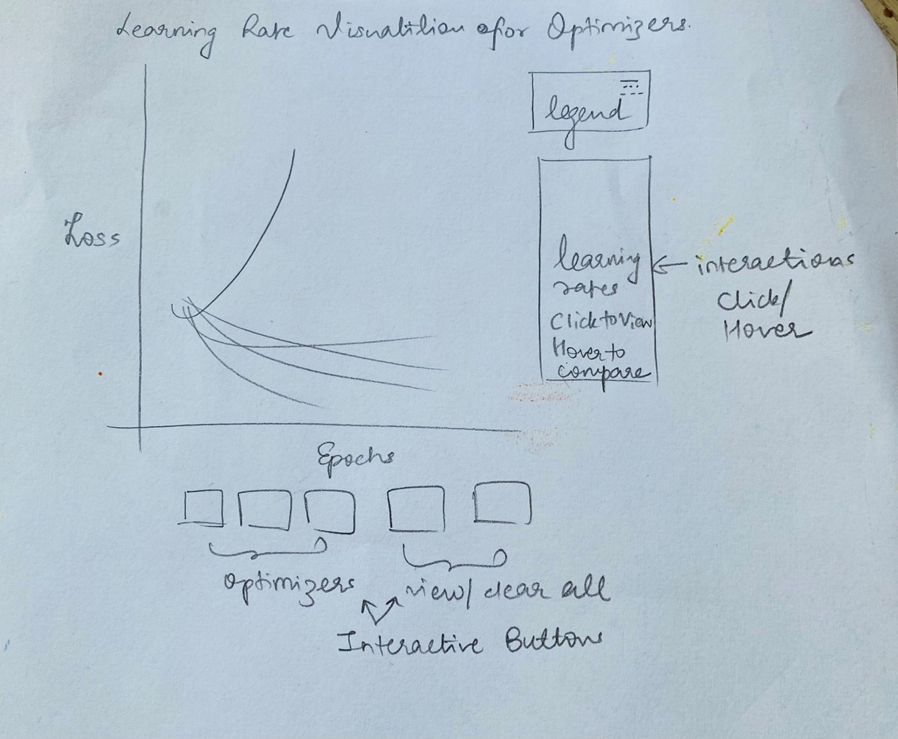
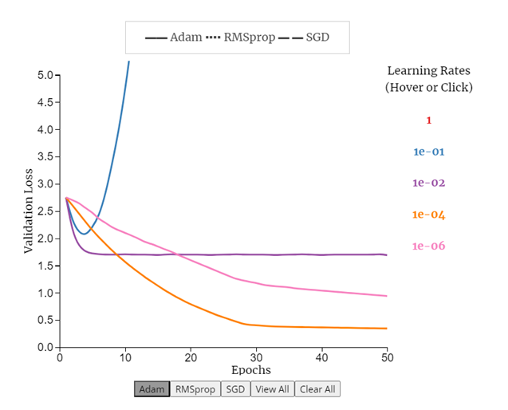
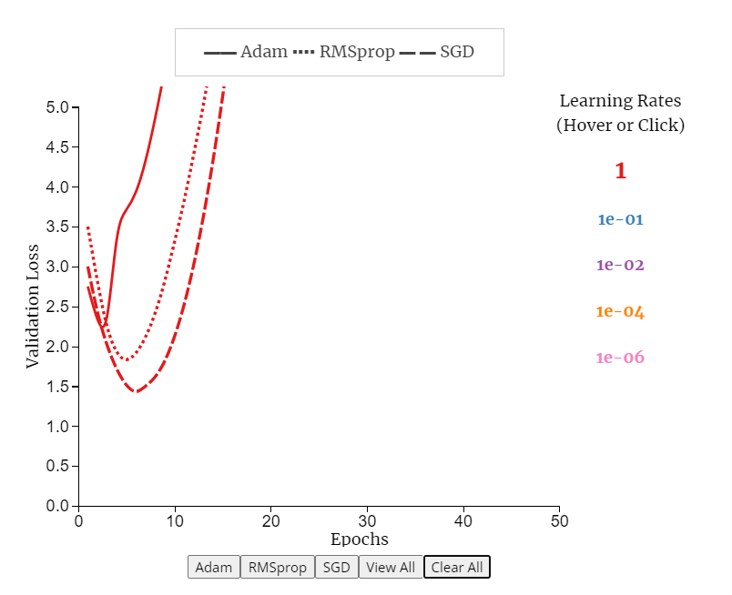
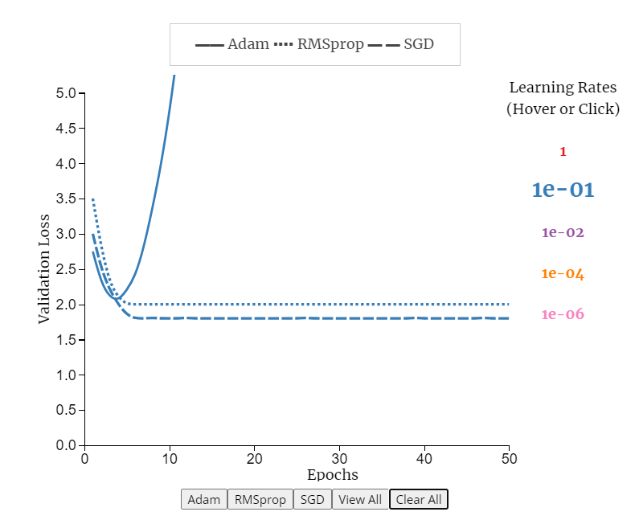
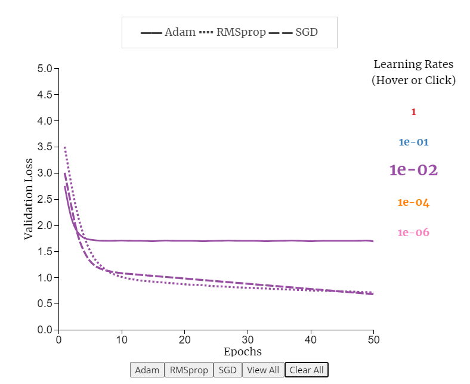
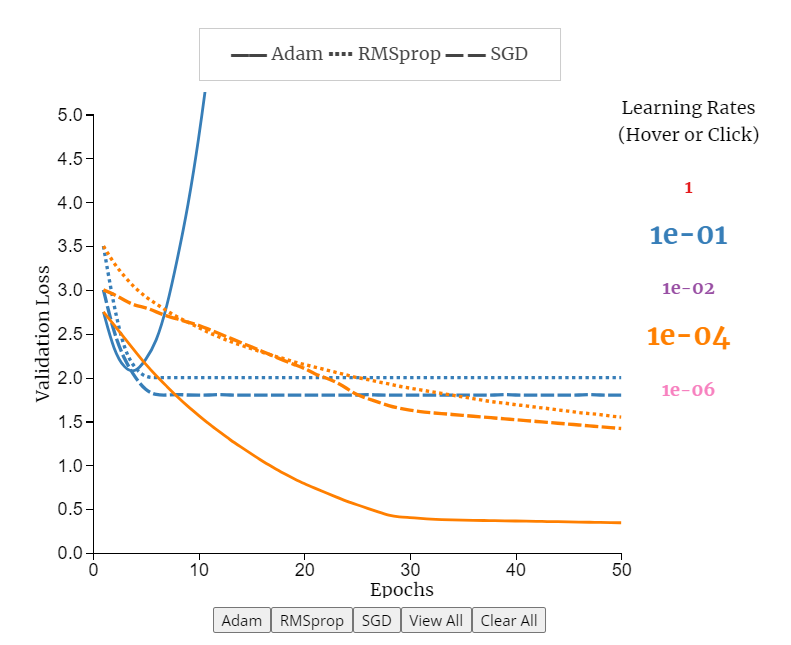
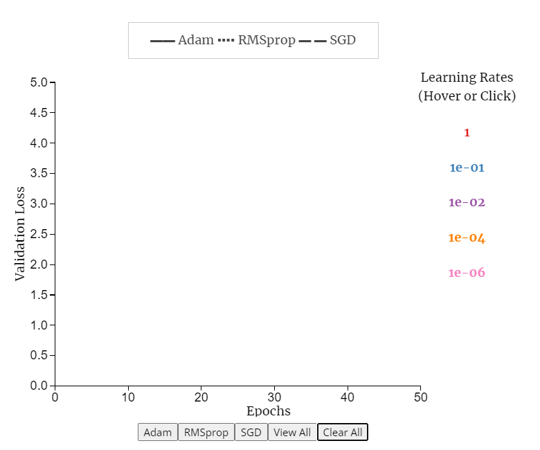
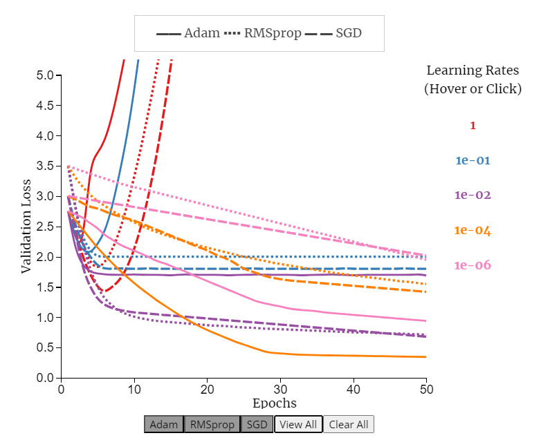
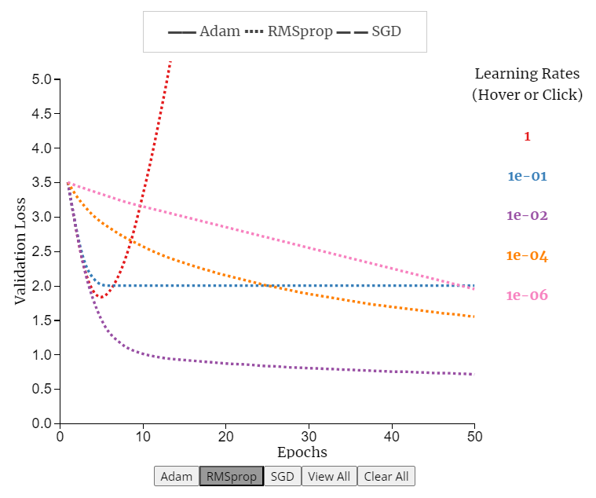
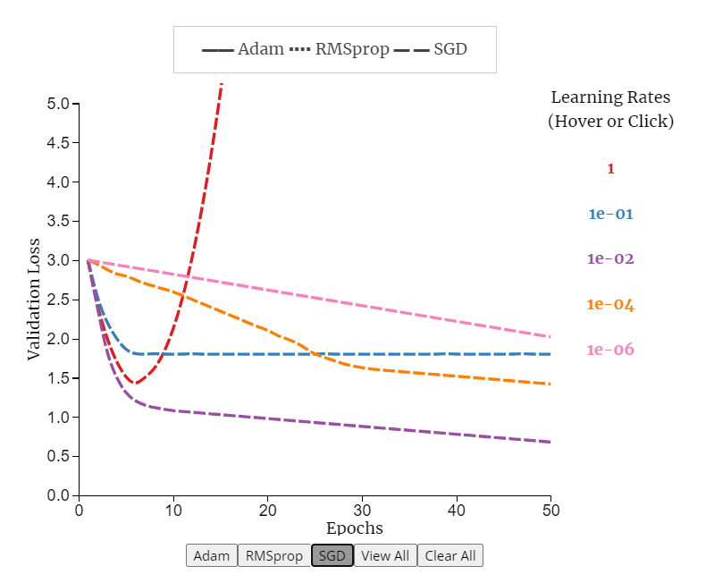

### Page 3 Design Decisions :
#### Choice of Chart Type
This page aims to provide the user an informative and interactive view of the effect of different learning rates on the optimizer performance. We consider 3 optimizers : Adam, SGD and RMSprop. We visualize the effect of 5 learning rates on each of these. For the choice of chart type, we experimented with small multiples, group bar chart, and density charts but found a single multi-line plot chart with user-interactions to be the most effective. 

#### Choice of Encodings
The goal of this visualization is to provide the user with 2 main interactivities : (1) compare different learning rates for each optimizer (2) compare different optimizers for each learning rate. Thus we choose the following encodings : 
-	X axis : Epochs 
-	Y axis : Validation Loss
-	Mark encoding (solid, dotted, dashed lines) : 3 Optimizers : Adam, RMSProp, SGD
-	Color encoding : 5 learning rates

We chose to encode learning rates with color and optimizers with marks and not vice-versa because if we gave mark encodings to learning rates, there would be 5 different marks (instead of 3 currently) and the user would be required to refer to the legend multiple times to interpret the visualization, which would increase cognitive load for the user. Hence we chose color encodings for learning rates and mark encodings for optimizers.

Choice of Color Scheme 

The color scheme was chosen in consideration to be colorblindness compatible with reference to the following link :

https://davidmathlogic.com/colorblind/#%23D81B60-%231E88E5-%23FFC107-%23004D40

#### Design Layout

  

#### Default View
The page begins with the default view of all learning rates for Adam optimizer. This default view is chosen because (1) the first view does not remain blank (2) viewing all lines together for all optimizers would clutter the plot and distract the user (3) Adam being the most used optimizer, viewing just this optimizer with all learning rates gives a nice idea that all learning rates do not perform equally for each optimizer. The button for Adam is turned dark gray in the default view indicating that it has been selected. 

Default view : All learning rates for Adam :

  

 

#### Interactions 
**Hover Learning Rates to View**
This interactive feature enables users to view optimizer performances for each learning rate. By hovering on any learning rate, the 3 optimizer lines for previously selected learning rate disappear and the 3 optimizer lines for the hovered learning rate become visible and stay visible till that learning rate is hovered upon. Once the hover is removed, those lines disappear. For easy interpretability, the learning rates in the interactive legend match the color of line plots for that learning rate. Also, the hovered learning rate becomes bigger in font to indicate current selection. 

For example :  learning rate = 1 :

  

For example :  learning rate = 1e-01 :

  

For example :  learning rate = 1e-02:

  

**Click Learning Rates to Compare**
When a user needs to compare several learning rates at once, they can do so by clicking on multiple learning rates. This will select the clicked learning rates to be visible on the chart till clicked again. 

For example :  clicked learning rates of 1e-01 and 1e-04 :

  

**View All, Clear All**

At any point, if the user needs to view all lines for all learning rates or clear the entire plot, they can do so using these 2 buttons.

Clear All button :

  

View All button : 

  

Note that all 3 optimizer buttons turned dark gray to indicate all 3 have been selected for viewing with the View All button. 

**Adam, RMSProp, SGD buttons**

These enable user to view all learning rates for a particular optimizer. Adam was seen in the default view. RMSProp and SGD are as follows, note that the corresponding selected button turns dark gray. 

  

  

#### References 

https://gist.github.com/JessicaFreaner/8fb0ac6c12aa1dab5f70     

https://d3-graph-gallery.com/graph/line_select.html

https://gist.github.com/eesur/6992045bafc8da95b98b

