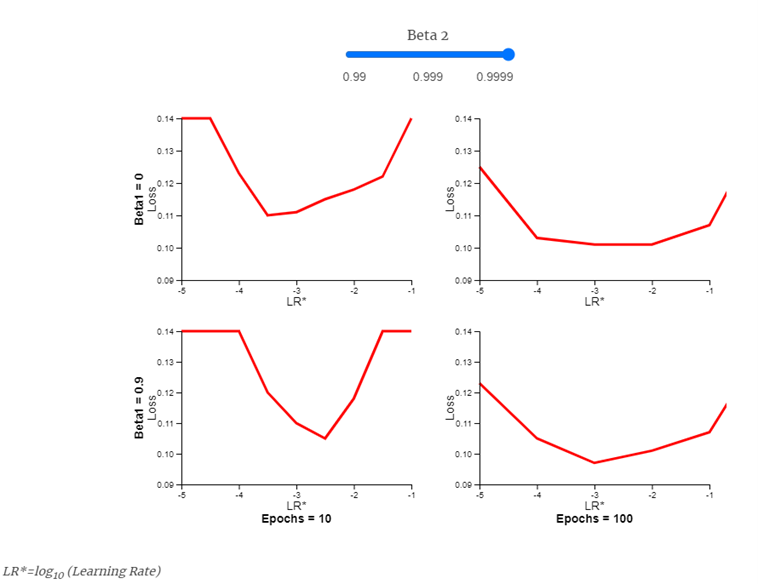
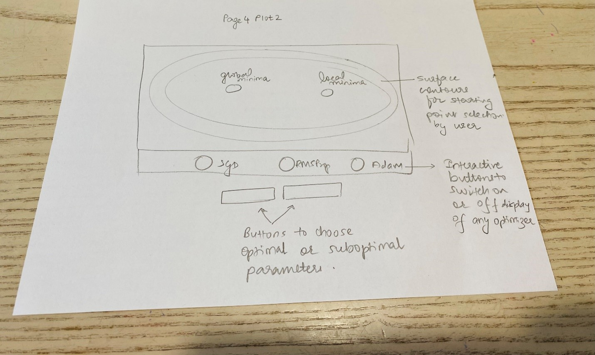
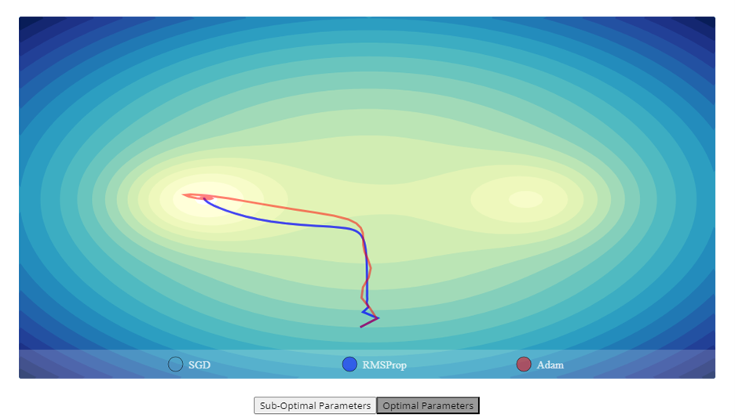
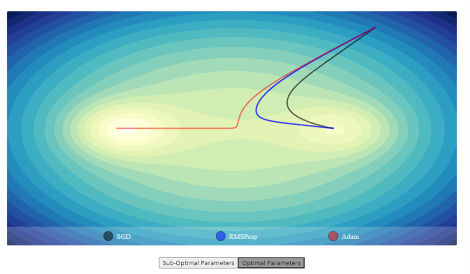

### Page 4 Design Decisions :

#### Choice of Chart Type
This page aims to provide user with 2 informative interactions : (1) fine tuning of individual parameters of an optimizer for example : Adam and (2) performance comparison of optimizers for final optimizer selection and their change in performance at optimal and sub-optimal parameters.  

For the first aforementioned use-case, we experimented with multiple line plot, small multiples, scatter plot, binned histograms etc. We found that 4 integrated subplots controlled with a single slider to be the most effective and expressive, the ‘4-in-1’, as we fondly called it in our team. 

For the second mentioned use case, we experimented with animated multi-line plots and line plots with drop-down menu. We found the chosen surface plot with global and local minima with allowed user interaction anywhere on the contours to be the most effective and expressive. 

####Design details for 4-in-1
In this plot, we visualize the hyper-parameter tuning for individual parameters of Adam : Beta1 and Beta2 for fixed epochs of 10 and 100.

#### Choice of Encodings
-	X axis : log10(learning rate)
-	Y axis : Validation Loss
-	Mark encoding : Line plot
-	Color encoding : single red color to maintain uniformity across all 4 sub-plots
-	Upper 2 sub-plots are for beta1 = 0
-	Lower 2 sub-plots are for beta1 = 0.9
-	Slider interactivity : Beta2 values in steps : (0.99, 0.999, 0.9999)

Blue color for slider and red color for line plot chosen to be compatible with color-blindness with reference to the following link :
https://davidmathlogic.com/colorblind/#%23D81B60-%231E88E5-%23FFC107-%23004D40

The X axis is kept as linear scale of log10(learning rate) instead of log scale to have magnified variations of loss visible for each log values of learning rate. The idea for this x axis scale is taken from the corresponding visualizations in Adam conference paper as cited in references below. Converting this to log scale instead, cramps the values in a smaller space and visualization of loss values at those points becomes illegible hence this scale is retained as linear. 

#### Design Layout

  

#### Default View
The default view is set to beta2 = 0.999 which is the default best value for beta2. i.e. slider position in the middle. So, even if in case user does not perform slider interaction, they will still have an informative visualization of loss values for beta2=0.999 and beta1=0 and 0.9 for epochs 10 and 100. 

  

#### Interactions 
Slider interaction in 3 steps : 0.99, 0.999, 0.999

For slider position, beta2 = 0.99: 

  

For slider position, beta2 = 0.9999:

  

#### Design details for page4-plot2
In this plot, we visualize the performance comparison of all 3 optimizers after tuning each of them for their individual best parameters. This enables selection of optimizer which performs best for the given use-case. Also provided for the user is the interactivity to choose suboptimal parameters to view performance degradation from any given starting point by the user. 

#### Choice of Encodings
Color encoding of black-blue-red is chosen for the 3 optimizers in consideration to be colorblindness compatible with reference to the following link : 

https://davidmathlogic.com/colorblind/#%23D81B60-%231E88E5-%23FFC107-%23004D40

#### Design Layout

  

#### Default View
Since the animation begins when user clicks at any contour point of his choice on the surface plot, the default view is set to the global and local minima. 

#### Interactions 
**Click any starting point on contours of the surface plot**
By clicking on any starting point, the visualization depicts the convergence of enabled optimizers from this starting point to global/local minima. The default settings are optimal parameters and all 3 optimizers enabled for viewing. Some examples are shown below:

  

  

**SGD, RMSProp, Adam Select to enable viewing**
By default, all optimizers are selected for viewing. If needed, user can choose to enable/disable their selection for viewing. 
When disabled, the corresponding round button becomes transluscent.

For example : SGD view disabled : 

  

For example : only Adam view enabled : 

  

**Sub-optimal/optimal Parameters buttons**
By selecting the corresponding button, the optimizers can be viewed for their sub-optimal or optimal parameters. The corresponding button turns dark gray to indicate selection. By default, optimal parameters are selected. 

For example : Sub-optimal parameters selection:

  

For example : Optimal parameters selection for same starting point:

  

For example : Optimal parameters selection from a different starting point:

  

#### References

Adam: A Method for Stochastic Optimization, Diederik P. Kingma, Jimmy Ba, 3rd International Conference for Learning Representations, San Diego, 2015, https://arxiv.org/abs/1412.6980

https://gist.github.com/EmilienDupont/aaf429be5705b219aaaf8d691e27ca87

Flexible numerical optimization with ensmallen, Ryan R. Curtin, Marcus Edel, Rahul Ganesh Prabhu, Suryoday Basak, Zhihao Lou, Conrad Sanderson, https://arxiv.org/abs/2108.12981, 
https://vis.ensmallen.org/

https://www.npmjs.com/package/d3-contour?activeTab=readme

https://gist.github.com/pstuffa/26363646c478b2028d36e7274cedefa6

https://yqnn.github.io/svg-path-editor/

https://www.researchgate.net/figure/Trial-results-of-all-optimizers-in-CIFAR-10-The-parameters-tuned-for-each-optimizer-as_tbl3_360042304

