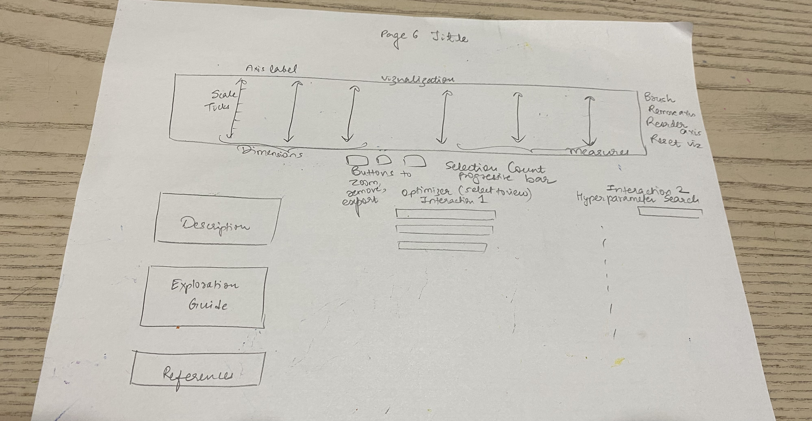
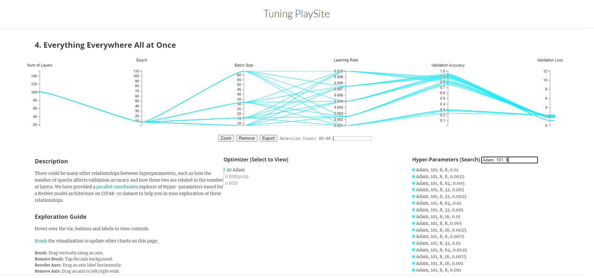
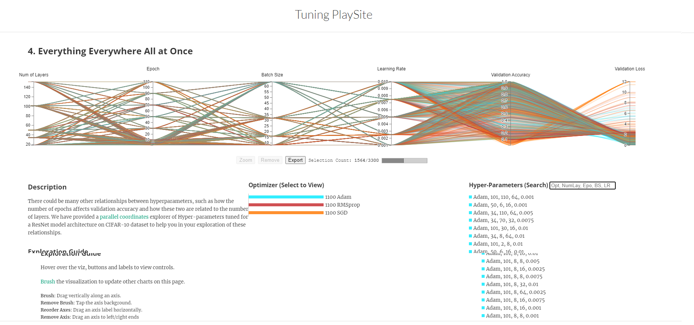
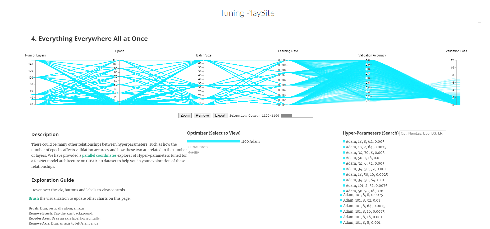
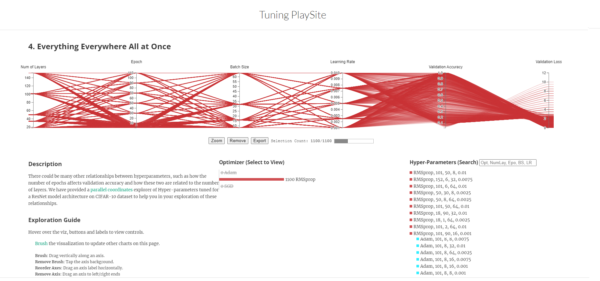
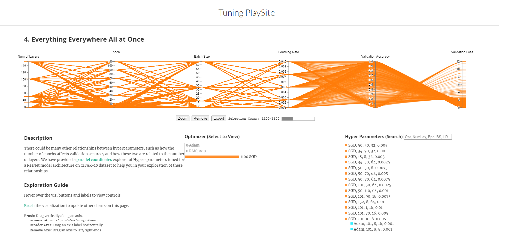
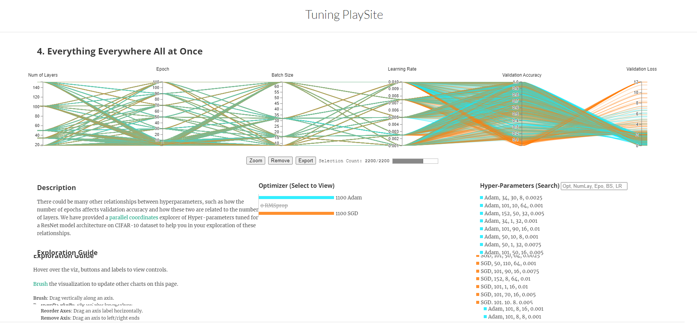
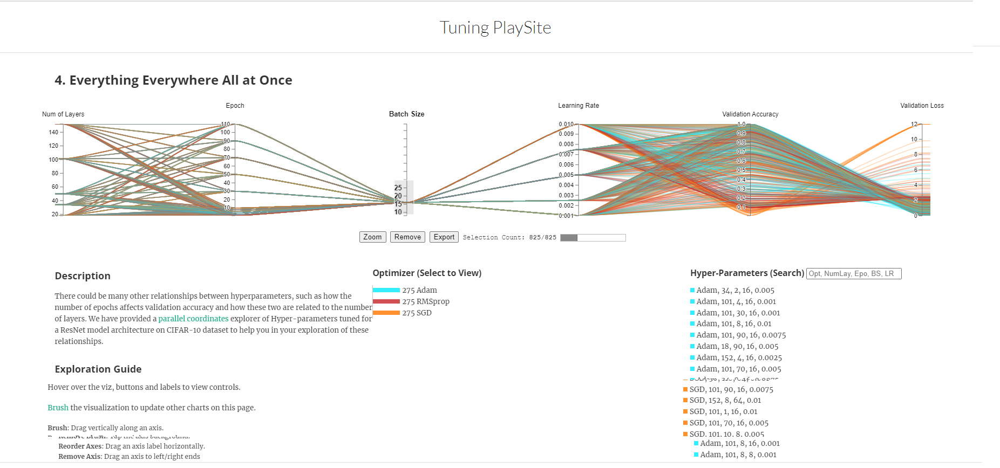
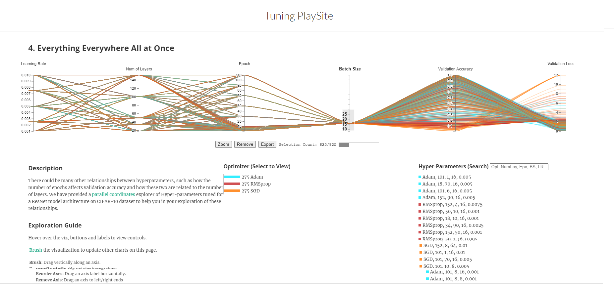

For the choice of hyperparameters, 
1. The most important one is optimizer. We went with three popular optimizers people generally choose: Adam (perhaps 90% use this), SGD and RMSProp. 
2. For epochs, we chose 1 to 10 with an increment of 1 and later with an increment of 30 upto 150. 
3. Next for the batch size, we chose 16, 32 and 64. We could have gone for 128 but limited machine capabilities. 
4. Later one of the most important yet mostly guessed is learning rate. In general most people choose between 1e-4 to 1e-2. For this we choose 0.0001, 0.0025, 0.005, 0.075 and 0.01. 

So the total rows of data came upto 765(3\*17\*3\*5). For the performance metrics, we choose Accuracy and Loss.

### Design Decisions
#### Choice of Chart Type
This visualization aims to provide the user an informative and interactive view of the relationship between various hyper-parameters and the effect of changing 1/more of these on the performance metrics. We considered several multi-variate plots such as small multiples, trellis scatter plots, grouped bar charts etc. We found the [parallel coordinates plot](https://syntagmatic.github.io/parallel-coordinates/examples/brushing.html) shared by Professor to be the most effective and expressive for our task. Each feature/variable is represented by a separate axis. All the axes are equally spaced and parallel to each other. Each sample/observation is plotted horizontally.
#### Choice of Encodings
Optimizer, Epochs, Batch Size and Learning Rate are the four independent variables in the visualization.

- Epochs, Batch Size and Learning Rate:

Variable type: Quantitative; Encoding: vertical axes in the plot; Scale : Linear

- Optimizer : 
Variable type : Categorical; Encoding : Color - all samples are colored grouped by optimizer 
(Adam : Blue, RMSProp : Red, SGD : Orange)

Accuracy, Loss and F1 Score are the three dependent variables in the visualization.
Variable type: Quantitative; Encoding: vertical axes in the plot; Scale : Linear
#### Design Layout

  

The layout and design decisions for this visualization are made with the user experience in mind. The vertical parallel plot is chosen instead of the horizontal plot with the dimensions placed on the left and performance metrics measures are on the right for the eyes to follow them from left(input) to right(output). The progressive selection bar shows the number of active samples in real time. The title is on the top middle. The description of the visualization is provided for the user’s reference. Parallel Coordinates are sometimes difficult to understand by someone new to this plot. Thus, hyperlinks for understanding parallel coordinates and brushing are provided for user’s reference. The exploration guide provides a quick guide to all interactions including how to remove brushing effect or reset the visualization. Parallel Coordinates examples used for adaptation are cited in references on the visualization. Dark background is set for aesthetics. Color scheme chosen : Blue-Red-Orange with text in White-Blue and dark background. The color selection was made with consideration for color blindness.

  

But the visualization encounters difficulty when dealing with a substantial amount of overlapping colors, resulting in color distortion at the left side of the plot. Multiple alternatives were tried but couldn't come up with a perfect color combination if there is one.
#### Interactions
1. **Hyperparameters (Hover to Highlight) /Search Bar**

The user is given the option to filter and view the samples with the Optimizer-Epoch-Batch Size-Learning Rate combination of their choice. 

-	Hover to Highlight: 

This interaction helps the user view single sample of interest with simple hover operation reducing cognitive load. 

  

In the above example, the curser is hovered on Adam, 101, 90, 16, 0.0075	sample. Thus, the corresponding sample is highlighted and every other sample turns gray to defocus other samples. 

-	Search bar :

This interaction helps the user when either multiple samples need to be searched for a particular combination or a custom combination of samples is to be searched which is not available in the given list to hover.

  

In the above example, Adam, 101, 8 is typed in the search bar. The samples that have Adam optimizer and 130 epochs are shown in the visualization. Also, correspondingly, the optimizer changed to Adam and number of active samples changed to 15 in the progression bar. 

2. **Optimizer (Select to View)**

  

Default view : all samples visible. 

  

In this example, Adam optimizer is selected. This remains visible whereas the other 2 optimizers turn gray. All samples corresponding to Adam are highlighted in the viz and other samples are defocused. The progression bar shows selection count for number of samples for Adam.

  

Samples for RMSProp

  

Samples of SGD

  

User can also view 2 optimizers at once by clicking on 1 and then second to be viewed.

Clicking on all 3 resets the visualization.

3. **Brushing**

This is 1 of the standard features of all interactive parallel plots. By dragging vertically on an axis, the user filters/selects the samples to view. Clicking on the axis again outside the filter resets the brush.

  

In this example, a brush is applied on the learning rate axis. Correspondingly, the samples that have learning rate in that range are visible.

4.	**Reordering axes**

By clicking on an axis label, the user can re-order the axis to view the plot differently. Resetting the visualization resets the order back to original. 

  

In this example, the learning rate axis is dragged to be the left-most axis. Refreshing sets back the visualization to original. 

This visualization for page 6 is our A3 submission with some minor changes incorporated as per peer review feedback for A3. The description and exploration guide are moved to the left instead of the right so the viewer can view them before beginning with the interaction. The removal of axis feature and zoom and remove buttons are added for additional interactivity.
